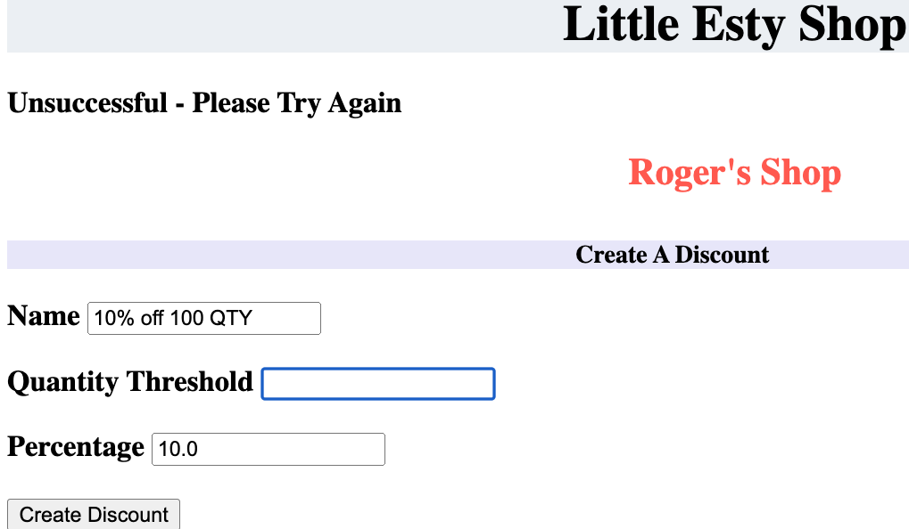

<a name="readme-top"></a>

# Little Esty Shop - Bulk Discount
"Bulk Discounts" is a brownfield app which adds functionality to "Little Esty Shop." The latter was a group project that requires Turing students to build a fictitious e-commerce platform where merchants and admins can manage inventory and fulfill customer invoices.
<hr> 
Bulk Discounts allowed merchants to create bulk sale discounts which the app would apply when necessary and adjust sale invoices appropriately. 
<br>
Additionally, the app calculated the bulk discounts applied to an invocie and provided relevant informaiton for the merchant.

<br>
<details close>
  <summary>Content</summary>
  <ul list-style-position="inside">
    <li>Specs and Launch Instructions</a></li>
    <li>CRUD</a>
      <ul>
        <li>CRUD Code Example</a></li>
        <li>UX with CRUD</a></li>
      </ul>
    </li>
    <li>Calculations - SQL</a>
      <ul>
        <li>Raw SQL Code</li>
        <li>SQL Query to ActiveRecord Method</a></li>
      </ul>
    </li>
  </ul>
</displays>

<details>
  <summary>Specs and Launch Instructions</summary>
  This app uses the following Ruby & Rails version:<br>
    Ruby 2.7.4<br>
    Rails 5.2.6.2<br>

  <hr>
  To run the app locally run the following 4 commands in your termianl:

    1. Clone the app to your local pc: $ git@github.com:Sergio-Azcona/Bulk_Discounts.git
    2. Set up the Gems & dependencies:  $ bundle install
    3. Database creation: $ rails db:{drop,create,migrage,seed}
    4. Run the server on localhost:3000: $ rails s

  Additionally, you can now run the test suite: $ ```bundle exec rspec spec```
</details>

<p align="right">(<a href="#readme-top">back to top</a>)</p>

<br>
<details>
  <summary>CRUD</summary>
  This app allows for full CRUD functionality. 
  <details>
    <summary>CRUD Code Example</summary>
      Here's an overview using the <i>BulkDiscountsController</i>: <br>
      
      
    <ul>
      <li>Notice that: if a user fails to create or edit a discount, they see a flash message and are returned to the create/edit page. The valid values they previously populated will prepopulate in the related fields</li>
    </ul>
  </details>
  <details>
    <summary>UX with CRUD</summary>
      Fields cannot be left blank. Let us see what the user experience is when they try creating a discount with a blank field:
      
      We are returned to the create page, informed that our attempt to create was unsuccessful, but the values we previously entered do persit!
      
      Last, once the user fills in the required field the new discount is created, they are returned to the dashboard, and a success message is displayed
      
    </details>
</details>
  <p align="right">(<a href="#readme-top">back to top</a>)</p>
  <br>

<details>
  <summary>Calculations - SQL </summary>
  Only 1 discount <i>could</i> apply to each line item on the invoice: <u>the discount most favorable to the customer</u>. A item could qualify for countless discounts but only the most customer-friendly discount mattered. Or, no discount could apply!
  <details>
    <summary>Raw SQL Code</summary>
    <ul>
      <li>The SQL query had to retrieve all the applicable discounts and return only the 1 discount (most favorable for the customer).<br> 
      Here is what the SQL query looks like
      
      NOTES:
      <li>the invoice_id '5' was used while tinkering with the query; this would become dynamic once the method was complete</li>
      <li><i style="color:dodgerblue;">invoice_items</i> and <i style="color:dodgerblue;">bulk_discounts</i> are in blue text to illistrate which two tables I needed to ultimatly join</li>
      </li>
  </details>
      <hr>
  <details>
    <summary>SQL Query to ActiveRecord Method</summary>
      <li>I leveraged ActiveRecord Associations to draw out relationships that allowed me to join <i style="color:dodgerblue;">invoice_items</i> and <i style="color:dodgerblue;">bulk_discounts</i>,  and create simple database queries.
      </li>
      <li>The Association allowed me to link the tables <i style="color:dodgerblue;">invoice_items</i> directly to <i style="color:dodgerblue;">bulk_discount</i>.<br> 
      Within the method I also created the alias <i>discount_amount</i> which is tallied in the sum method on line 23. This was needed to capture the total amount from all the discounts applied on a singel invoice.
      </li>
    </ul>
  </details>
</details>
<p align="right">(<a href="#readme-top">back to top</a>)</p>